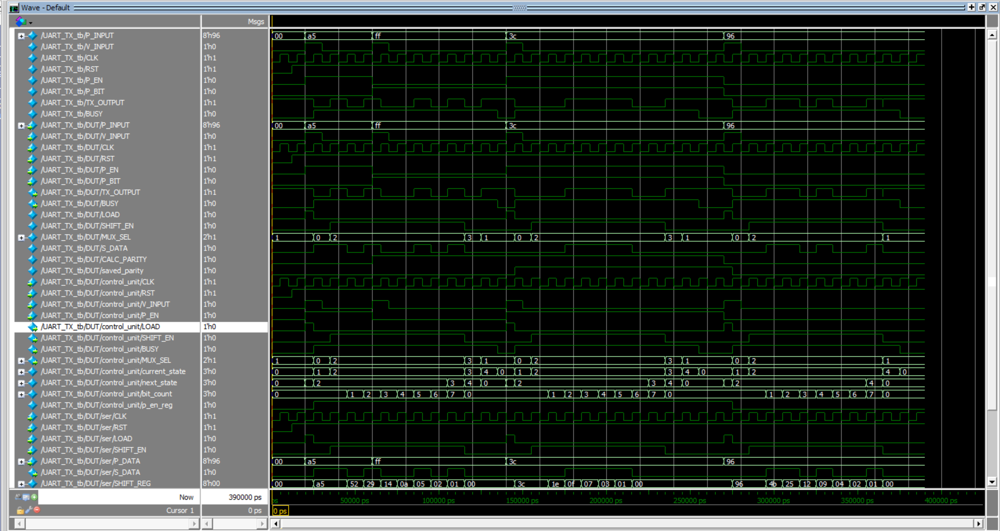
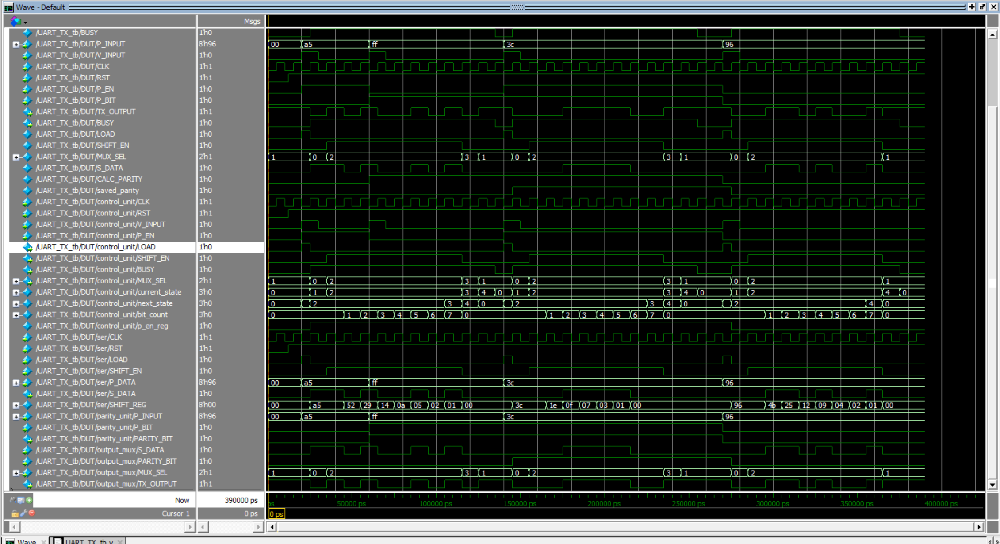

# UART TX Using Verilog

This project implements a parameterized UART transmitter using Verilog.

The transmitted frame contains:

- One start bit (`0`)
- `W` data bits sent LSB first
- An optional even or odd parity bit
- One stop bit (`1`)

## Project Modules

- `serializer.v`: converts the parallel input data into serial data.
- `parity_calc.v`: calculates the even or odd parity bit.
- `main_controller.v`: contains the FSM and the data bit counter.
- `mux.v`: selects the required UART output bit.
- `UART_TX.v`: connects all the modules together.
- The `_tb.v` files are used to test the modules and the complete transmitter.

## Main Signals

- `P_INPUT`: parallel input data.
- `V_INPUT`: starts a new transmission when the transmitter is idle.
- `P_EN`: enables or disables the parity bit.
- `P_BIT`: selects even or odd parity.
- `TX_OUTPUT`: serial UART output.
- `BUSY`: indicates that a frame is being transmitted.

## Simulation

The project was simulated using QuestaSim.

To compile and run the complete UART transmitter:

```tcl
do run.do
```

Each transmitted bit lasts one clock cycle in this course project.

## Simulation Waveforms

### UART TX Waveform



### Internal Signals

